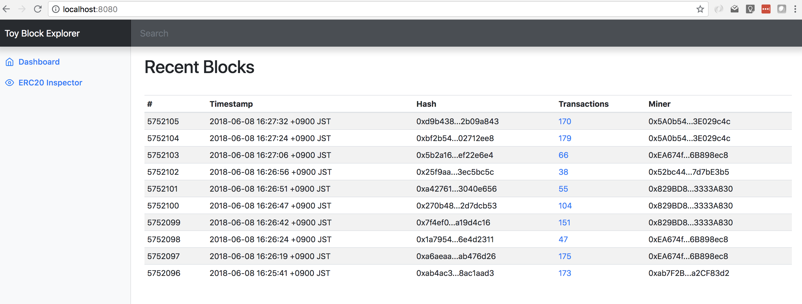

# toy-block-explorer
A blockchain explorer written in Go to learn about building server-side applications that work with the Ethereum blockchain.



## Pre-requisites

You will need to install the following to build and work with this project:

- [Go](https://golang.org/doc/install) (also called 'golang') a programming language. Advanced macOS users will probably want to install via [Homebrew](https://brew.sh/).
- [Git](https://git-scm.com/downloads), a package management system. For macOS users, we again recommend Homebrew. For Windows users, at this point it would be prudent to install [Cygwin](https://www.cygwin.com/), which gives you access to many Unix commands, including Git. You will need to ensure that Git is selected during the Cygwin installation process.
- [Geth](https://www.ethereum.org/cli), the official Ethereum node and command line interface (CLI) tool.
- This repository and its submodules, which you can install by running:

```sh
$ git clone https://github.com/curvegrid/easy-geth-dev-mode.git
$ git submodule init
$ git submodule update --recursive
$ cd toy-block-explorer
```

Optional components and setup steps include:

- The [go-ethereum](https://github.com/ethereum/go-ethereum) libraries are also a pre-requisite, but the included `build.sh` command will run the required `go get` command to pull these in for you.
- [abigen](https://github.com/ethereum/go-ethereum/wiki/Native-DApps:-Go-bindings-to-Ethereum-contracts#go-binding-generator) and [solc](http://solidity.readthedocs.io/en/v0.4.24/installing-solidity.html) are required if you wish to regenerate the `erc20.go` file from its `ERC20Interface.sol` source.

## How to use this tutorial

This tutorial is broken down into several stages, separated by git branches. The default `master` branch contains a bare bones web application. Subsequent intermediate branches, `step-1`, `step-2`, etc. contain more and more of the block explorer functionality filled in. The complete explorer is in the branch `step-final`.

The idea is for you to start will the bare bones web application, and build the complete block explorer yourself. If you get stuck, you can always skip ahead of examine the next step's branch for hints or help. Of course, it's up to you, so feel free to start with `step-final` and work backwards!

You can checkout a specific branch with:

```sh
$ git checkout -b step-N
```

Learn more about working with Git [here](https://try.github.io/).

## Setting up a local blockchain node for testing purposes

We use the full Geth Ethereum node running in a development mode, since it most closely mimics the operation of a production blockchain node. We've included the [Easy Geth Dev Mode](https://github.com/curvegrid/easy-geth-dev-mode) set of scripts as a submodule, along with a sample chaindata folder pre-populated with a few transactions, to get you started.

First, ensure the Easy Geth Dev Mode submodule was pulled in correctly:

```sh
$ git submodule init
$ git submodule update --recursive
```

Copy the sample chaindata folder into the submodule:

```sh
$ cp -R geth/sample-chaindata geth/easy-geth-dev-mode/chaindata
```

Run Geth:

```sh
$ cd geth/easy-geth-dev-mode
$ ./launch43.sh --ipcdisable --startrpc
```

A local version of Geth is now running with a JSON RPC endpoint exposed at http://localhost:8545

Once you're finished with Geth, be sure to stop it:

```sh
$ ./stop43.sh
```

## Building and running the project

Run the build script:

```sh
$ ./build.sh
```

This will generate a `toy-block-explorer` executable:

```sh
$ ./toy-block-explorer 
2018/06/08 15:02:50 Connecting to Ethereum node at http://localhost:8545
2018/06/08 15:02:50 Web server started on :8080
```

Try browsing to http://localhost:8080

The toy block explorer has a number of command line options:

```sh
$ ./toy-block-explorer -h
Usage of ./toy-block-explorer:
  -ethendpoint string
    	Ethereum node endpoint (default "http://localhost:8545")
  -host string
    	Hostname to bind web server to
  -port int
    	Port to bind web server to (default 8080)
  -templates string
    	Templates glob (default "templates/*")
  -www string
    	Directory to serve (default "www")
```

If you want to connect it to the Ethereum mainnet, sign up for an [Infura](https://infura.io/) account and have the block explorer connect to it instead of your local Geth dev node:

```sh
$ ./toy-block-explorer -ethendpoint https://mainnet.infura.io/<API key here>
```

## Licence
MIT

## Copyright and credits
Go source files copyright (c) 2018 Curvegrid Inc.

Portions of the HTML based on [Bootstrap's samples](http://getbootstrap.com/docs/4.1/examples/).

ERC20 Solidity interface based on [The Ethereum Wiki's ERC20 Standard page](https://theethereum.wiki/w/index.php/ERC20_Token_Standard).